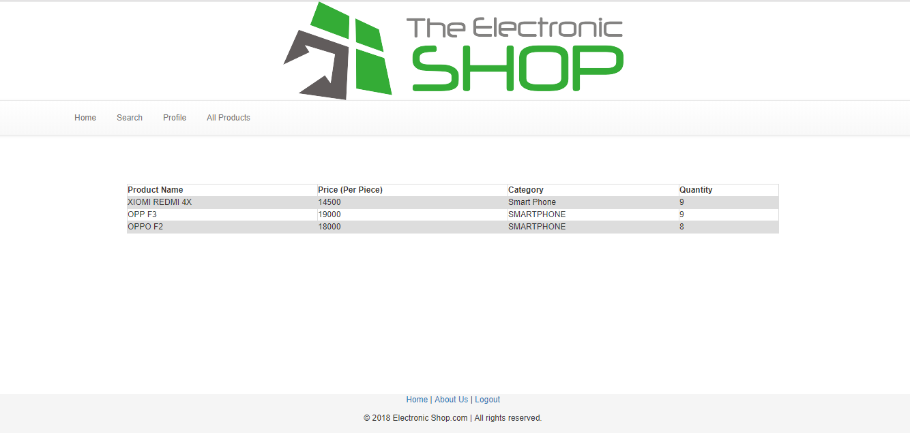

# e_shop
It is a web project using distributed database technology to manage supershop's information and inventory

# Features
* Add product
* Search product
* Delete product
* Employee information (Deferent infortmation for deferent branch)

# Tools used
* PHP (No framework)
* HTML
* CSS
* Javascript (No framework)
* Oracle SQLDeveloper (For distributed database systems)

# Screenshots
login

Menu and others

Products

